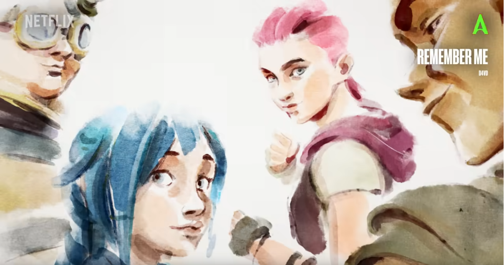
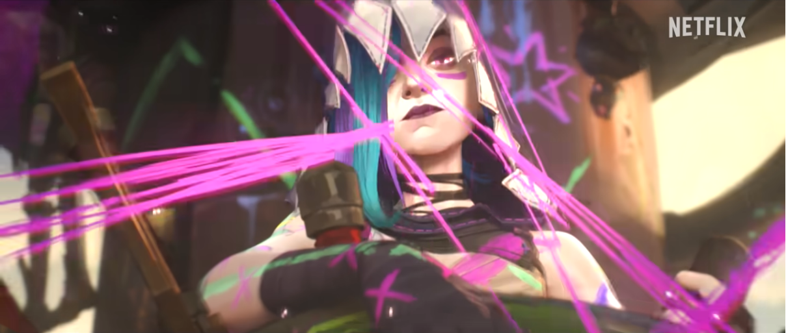
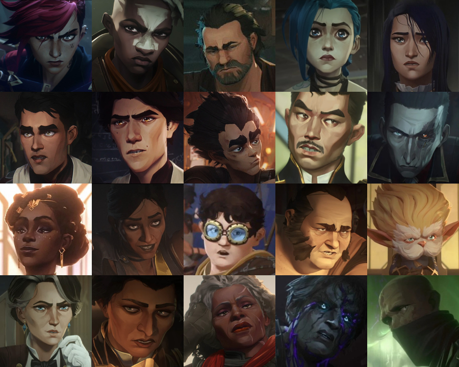
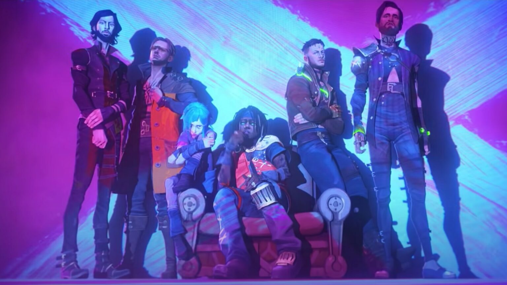

+++
author = "anirbaaaan183"
title = "Arcane - Absolute Cinema"
date = "2024-12-15"
description = "My thoughts on Netfilx and Riot Games' animated series Arcane."
tags = [ "series", "review", "opinion" ]
categories = [ "reviews" ]
image = "cover.jpg"
+++

I am going to give you a hot, yet very agreeable take. Arcane is probably, THE
BEST piece of media ever conjured by humans, period. It can only be aptly
described with one phrase - "Absolute Cinema". The animation, the story, the
unpredictability and the absolutely fantastic music! This show is going to
dictate my personality for a while now and is stuck in my head till date. This also
gives me an amazing topic to write on for my first blog! Note that I will be
fanboy-ing all through this article. I never thought I would ever call a TV show
life-changing, but here we are.

## Preface
This blog might contain spoilers ahead and so it is recommended to watch the show
before reading this. Also I will assume you already know the names of all the
characters in the show, which just emphasizes this point even more. That being
said, I will try my best to not reveal too much about the story.

## Introduction
Arcane is a 2 season animated series based in the League of Legends universe.
League of Legends is a game made by Riot Games which has its own world and lore.
This show expands on this existing lore and dives deeper into some well-known
characters' origins and also displays some important events that occurred in the
universe. Over the course of the show, several different character and story arcs
are explored while keeping the primary plot of Vi and Jinx's story at the center
stand.

## The Animation
It won't do justice to the show to not talk about the animation first. Now see,
I am not a cultured dude. I haven't seen any "anime" shows before; animated media
yes, anime no. And I don't think Arcane can be called a anime? Idk, I am not sure
about the specifics. But I don't think I can watch anime now, at least for a while
now. Arcane has set my expectations HIGH and it pains me that it would probably be 
a while before we see anything even close to the quality of this
show, at least at this scale. One look at any single frame of the show and the
250 million dollar budget and 6 + 3 year production time of the show makes sense.
I had already seen some of Fortiche's (the animation studio behind Arcane) work
from League of Legends cinematics and music videos, but they have really pushed
the boundaries of animation with this show. They really explore the whole gamut of
animation styles too. From neon outlines, charcoal backgrounds to full watercolor
animation Arcane has it all. Even in the base animation style which is 2.5D hand
painted 3D animation we see many many variations for different important scenes
and moods. Almost every frame of the show could work as a wallpaper.

## Aesthetics
I thought about adding this section to the Aesthetics portion itself by this
deserves its now heading. What doesn't Arcane do? Arcane has several aesthetic
styles ranging from Cyberpunk to Steampunk, Medieval to Modern and makes it work
really well. I absolutely love the costume designs of the different characters. The
amount of details in the character models is unprecedented. If they every released
a clothing line based on Arcane costumes, it will sell out quick. I sure as hell
will love that. Especially in Jinx's perspective, who is a grand presentation kind
of character with flashy entrances and bold colors. I love how they visualize
trauma and the mental burden of all the characters, especially Jinx. Being able to
visualize the voices inside Jinx's head sure helps visualize the burden she is
carrying. This doesn't really belong in Aesthetics, but the camera shots dude -
absolutely insane. The composition and presentation of some scenes are just
breathtaking. There are too many amazing shots to talk about.

## The Story Line
Oof... Just Oof. The story for this show is straight amazing. Going from the
rather grounded story about the separation and eventual reunion of the sisters,
Vi and Jinx in Season 1 to the absolutely bonkers multiversal, time travelling,
alternate reality aspects of Season 2 which ended with a war for humankind was a
hell of a journey. The writers somehow made this evolution of the story line
absolutely seamless. Even the tiniest of details held major story values and
absolutely NOTHING was left to fate. Every single pixel on the screen had a
purpose. Every single fight scene moved the story forward in a meaningful way,
whereas we usually find fight scenes in television to be solely for the hype and
display. It is genuinely hard to believe that this is a completely fictional
story. Yes, there are some real-life parallels, but almost everything in this
universe completely fictional which includes the basic understanding of science
itself. In my experience, this kind of powerful, emotional and touching story is
generally found in "based on a true story" type shows. The writers deserve great
praise for adding such depth to an animated, fictional, action show.

## The Characters
The fact that the characters aren't real and I can't ever physically meet them is
sad. Bummer is that as the show is animated, we won't see a lot of these
characters ever again. If I had to describe character development in one word, I
would say "Arcane". Every single character arc is very very well developed.
Everything a character does makes sense inside the bounds of the character. Maybe
flawed, wrong and/or nonsensical sometimes, but true to their characters. There
is no hero or villain in this show. Just people trying to live and improve their
lives. Some characters are more morally flawed than others, but there is no black
and white. Only different shades of gray. Almost every character is relatable and
like-able in their own way. Almost, because all my homies HATE Maddie, like despise
that beotch.

The background every character comes from becomes clear with every move they make.
Every piece of dialog, all the facial expression and micro-expressions. Its hard to believe that all the micro-expressions were hand animated as there was no mocap used, like damnnn. I wanted to talk about a couple characters in details -

`Major Spoilers Ahead`

### Jinx/Powder
I feel for her deeply. Poor girl was continuously subjected to trauma from a very 
young age. Lost everyone she cared for in the blink of an eye. Worst part is that
she was the reason they died. Her sobbing while saying "I only wanted to help" was
a painful scene to digest. She was criticized by many for latching on to Silco so
eagerly, but she was just a child who had lost her parents a while ago and now
lost her father figure, sister and friends due to her well-meaning mistake. Then
seeing her finally happy with Isha in Season 2 only for Isha to be taken away was
absolutely heartbreaking. Know the alternate reality version of Jinx who was still
Powder and then hearing her say "there is no good version of me" was painful. Her
trying to kill herself and her sacrifice at the end were hard to watch. HOWEVER, I
believe that she is alive. The pink trail, the air duct blueprints, the blimp(?) at 
the end; and I will die on that hill. I refuse to believe that her story ended while
still believing that she is a jinx.

### Vi
Oh god. She also lost everyone, then had to see her only hope in the world - her 
sister go down the dark path. Her asking Caitlin to stay with her - "Everyone in my
life changes, promise me you won't change" very aptly shows her pain. She carries 
the guilt for creating Jinx and letting down Vander even though those weren't really
her faults. Much like Jinx, she never had a good time except with Caitlin.
Fortunately, she had Caitlin by her side at the end, even though she lost her 
sister.

### Vander
No. NO. NOOO. Let him rest dude. He deserves to rest. I can't even talk about him.
The pain of losing Vander and then the hope of getting him back, which go absolutely
crushed was too much to bear.

### Isha
I was sobbing. I was barely keeping my shit together. I don't think I can think
about her anymore. She didn't deserve it.

### Ekko
The only morally white person in the show. Didn't even have a hint of gray in his
character. He could have everything he ever wanted, but decided to leave if all
behind of the people who needed him. Absolute legend.

### Caitlin
All she wanted to do was good. Be a good enforcer, bring fair justice to the people.
Then she lost her mother. Her arc was really tragic and the character was really
well written.

### Jayce and Victor
I don't think it would be appropriate to talk about these characters separately.
The undercity scientist and the lower house visionary trying to make it big in
an aristocratic city. I haven't seen characters like these before. The general 
consensus of these characters fluctuated like crazy. The story arc of their paths 
diverging and eventually converging to both of their end was beautiul. Absolutely 
fantastic characters.

### Mel and Ambessa
These are very underrated characters. Ambessa got much praise for her combat
expertise and Mel was a badass (the ricocheting bullet... oooof). But their
background arcs was probably taken a bit lightly. The Blood, Sweat and Tears music
video shows us glimpses of Ambessa's origin and it's amazing.

There were many other characters I would love to talk about and even expand on some of the characters I already talked about I don't want this blog to become huge and
watching the series will tell you my thoughts. So I am going to move on.

## The Arcs
`Major spoilers ahead`

The sheer number of arcs in this show is crazy. They work well together too, with
all the different arcs intricately woven together into a beautiful masterpiece. The 
main arc of the separation and eventual reunion of the sisters, Vi and Jinx/Powder 
kept at the center stage while all the other arcs revolve around it was a story
choice I wouldn't have expected. Usually shows, movies don't branch out this widely
from the central plot. BUT IT EFFING WORKSS! Like I said before - absolute cinema.
The galaxy brained people behind this series deserve so much praise. Humans made
this show! WHAT!? Here are some of my favorite arcs -

### Jinx-Isha
This was such a heartwarming arc, ending with a heart shattering event. The end of
this arc absolutely beat the living shit out of my heart. Seeing Jinx happy and not
hell bent on killing herself was a refreshing sight to see. I absolutely love the
dynamic between them which was a mother/sister kind of dynamic which parallels
Vi and Poweder's relationship towards the beginning of season 1. I have a love-hate relationship with this arc.

### Ekko-Jinx
"What could have been" - mann, I would love to see them together. This gives an
entirely new look on the enemies to lovers trope. Seeing the dance scene with
grown up Powder (who didn't turn into Jinx) was a bittersweet experience. I would
give so much to look at the deleted scenes of Ekko and Jinx getting prepared to
fight in the war for humanity. I want more of this and I hope we will get that in
one of the 3 announced series.

### Vi-Caitlin
This was complicated af. People bang their heads over "situationships" these days
but nothing comes close to the relationship Vi and Caitlin had. At least hey ended
up together in the end. Its good to know that some people had a decent-ish outcome
at the end of the series (cough* Singed cough* cough*).

## The Music
There is a very common joke among the players of Riot Games' games, "Riot is an
amazing music company that makes good games on the sides." Arcane's soundtrack
does nothing but corroborate this. Words can't describe how stellar the music in
this show is. Goodbye, What have they done to us, Remember Me, Isha's Song,
Wasteland and The Line basically shattered me to pieces. On the other hand, Pain
the town blue, Dynasties and Dystopia, Come Play, Heavy is the Crown and Renegade
just hyped me up and filled me to the brim with adrenaline. Then there were songs
like Enemy, Ma Meilleure Ennemie, Playground and Sucker which did something to me I
can't even explain. I absolutely love the concept of adding a music video to each
episode. I have seen this concept in Bollywood movies, but they are mostly generic
music videos which have nothing to do with the story. A couple movies and shows
I've seen did a decent job at this though. Some recent examples which come to mind
is Pixar's Elemental and Dreamworks' Wild Robot but nothing even come CLOSE to
Arcane. This show also explore a wide, and I mean wide, range of genres. From 
country to pop to edm to metal, there is at least one song that satisfies listeners 
of any kind of music. Wild... just wild.

## Conclusion
That's it for my review. I think? I said everything I wanted to talk about. I might
edit this blog in the future as more thoughts pop up in my head. I haven't been able
to let go of this show. I have been just watching different types of arcane 
content, reactions after reactions, and only listening to the Arcane soundtracks
for a while now. Arcane is going to be my personality for at least til the end of 
the year and probably for a while into the new year. When I said at the beginning of
this blog, that the series could be called life-changing, I wasn't kidding. It gave
me a different perspective on the world, the people around me. Anyone can be a
villain in someone else's story. We are all people trying to make it in this world.
Everyone has their own reason to do what they do. This doesn't excuse one's wrongs,
but it does give us a perspective into other people's lives. I love this show, and I
will keep loving it.

Thanks for reading my yapping. Stick around.
Smile :)