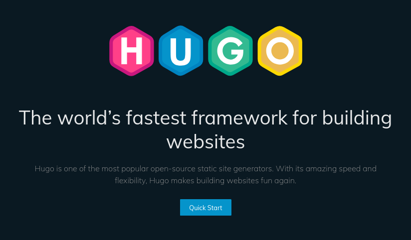
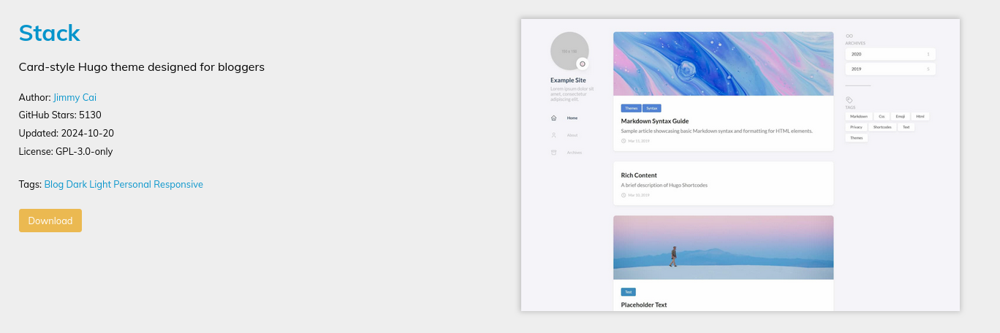
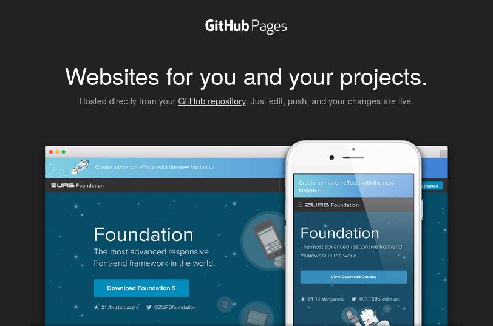
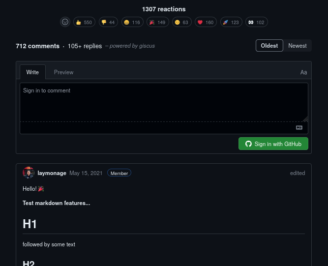
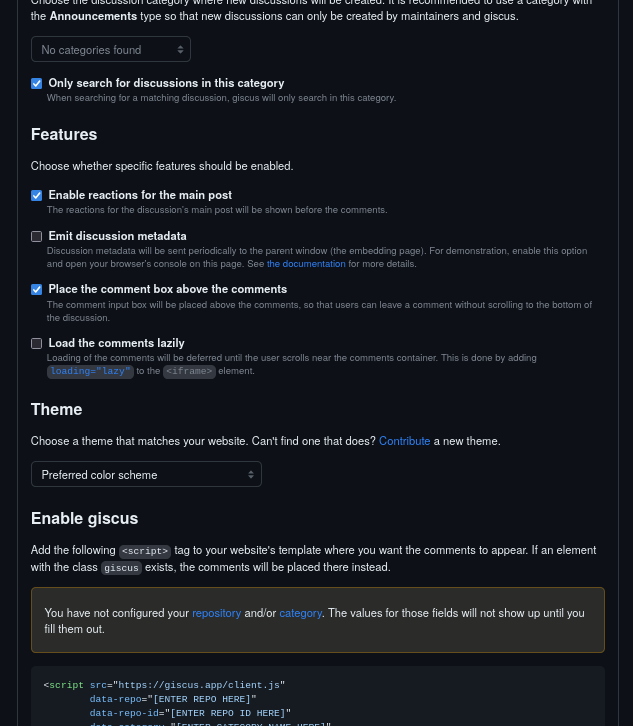
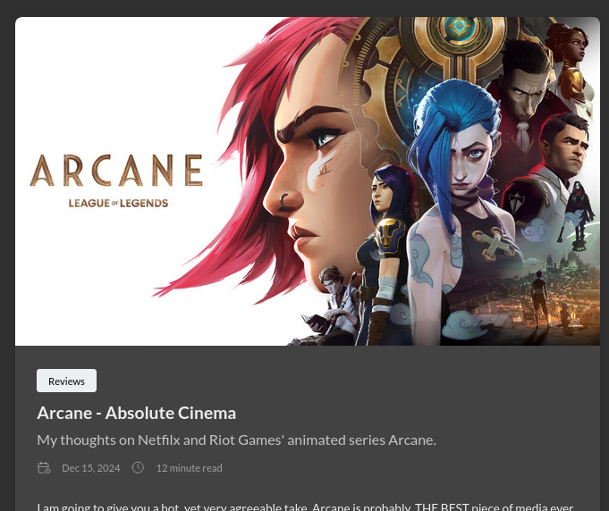

+++
author = "anirbaaaan183"
title = "Why bother with a blog? And how? Asking for a friend"
date = "2024-12-15"
description = "Why should anyone make a blog? Why and How did I?"
tags = [ "tech", "documenting", "opinion" ]
categories = [ "tech" ]
image = "cover.jpg"
+++

In today's day and age, blogs, or at least personal blogs have become far and sparse
in my experience. Most blogs I come across are tech papers, articles or reviews on
[Medium](https://medium.com/) or [Dev](https://dev.to/) which also contains
shitposts here and there. I am an avid viewer of
[ThePrimeagen](https://www.youtube.com/c/ThePrimeagen), especially his channel
[ThePrimeTime](https://www.youtube.com/@ThePrimeTimeagen). In this channel, he
reads and reacts to different article among other things. This has made we want to
write my own blog for a while now, but I didn't want to do it on established
platforms. I am trying to maintain what one could call an internet bubble where
people like me can come together and connect but other people probably wouldn't ever
find out.

## Motivation (Why?)
As I said above I want to create my internet bubble, but why a blog? I could have
just made a discord server and called it a day, right? The thing about instant
messaging platforms is the lack of length. Short and sweet messages or posts which
engages other people for a while and probably already forgotten about as one scrolls
on to the next post. I want a space where I can write in detail about something and
do whatever the eff I want without worrying about engagement and the length of my
posts. Hence a blog, and a custom one at that where I am not bound by guidelines and
quality assurance and can do whatever the fuck I want. Yes, that includes dropping 
the f bomb here and there, though I will generally keep this family friendly.

## Content (What?)
Now, what kind of content will I pour into this blog? As discussed above...
whatever I want! That's the beauty of it. I am a tech oriented person while also
having a interest in audio-visual media especially music and series. So, in general,
the content will probably be around these but there is no limit. My first blog was
about Arcane, my favorite series, which I posted just a bit ago before starting
to write this one which is my second. Generally, people would assume this one to be
a first blog right? Well, it isn't... and everyone will have to deal with it. I love
this blog already!

## Making (How?)
All that being said, lets make a blog! The blog has been months in the making
actually. In my head, yes, but still months in the making. I only got into actually
realizing this blog 2 days ago. One thing about me is, I am a legendary player in
the small game people like to call "procrastination". I would probably participate
if there was a tournament or something. Maybe I won't, I'll just procrastinate on
participating in it. Anyway, getting back on track, lets dive into the process!

### Preparation
This is the months long phase where I was making this site into my head. Though
nothing I had planned actually took place xD. I ended up completely changing the
plan in the end, which was 2 days ago. My original plan was to make a website from
scratch using the very basic html-css-js stack and using firebase to save and load
the blogs. But when I actually started to research for making this blog 3 days ago,
I came across [Hugo](https://gohugo.io/). All my homies love Hugo. Hugo is a static
site building tool which automatically converts markdown text to html files which
can be rendered on a website! This was fantastic in and out of itself but Hugo also
had community made themes! So basically, the whole site was served to me on a 
platter. I just had to squash the different ingredients together into a working 
blog!

### Experimentation
With a game plan, kinda, I just dive right in, in a very me fashion. I download Hugo
which was just `sudo dnf install hugo` in the terminal for me, being a Fedora guy
(without a neck-beard somehow :/). Then I started exploring the themes. After trying
a few and getting sidetracked into making my portfolio website instead of this blog,
which I eventually abandoned and focused on this blog; I stumbled upon the
[Stack](https://stack.jimmycai.com/) theme, which was a beautiful and minimal theme
designed for blogging and perfect for my needs. There it was, the perfect template.

### Implementation
After having finalized the look of my site, I actually had to finalize and deploy
the site. After reading through the Hugo documentation and watching a couple YouTube
videos I decided to host the site on [GitHub Pages](https://pages.github.com/). This
was great for me, as I was already accustomed to both GitHub as well as Github 
Pages. Up till now, everything was going more or less smoothly. Then things started 
going downhill a bit. I, being a leap before you think guy, just started doing shit 
left and right and breaking shit left and right. Everything was working and not 
working at the same time. A typo here, file in wrong directory there, it was a mess
for a while. But eventually I, finally learned how Hugo works and how to actually
deploy it on GitHub pages.

After that I wanted to add a comments feature to the
blog. It seemed easy as the theme Stack, already had a comment section
implementation and provided several comment engines to choose from. I eventually
landed on [Giscus](https://giscus.app/) which uses a GitHub repository's 
discussion feature to make comments work. I didn't have to trust a third party to
maintain the comments or host a database of my own. All all one needs to do to
comment on the blog is have a GitHub account, which is basically anyone even
remotely related to the tech fields.

I am sure by now you would have noticed a pattern of me diving head first into new 
technologies without reading the docs. I did in fact shoot myself in the foot this 
time too. However, this time, the docs didnt help me either. The Stack Theme docs 
just redirected me to the `giscus.app` website which comprises of just a bunch of 
settings and a demo comment section. I entered my repository and the settings 
expecting the website to automatically apply those to my blog but obviously it 
didn't. I did notice a code section below but ignored it (bruh). Anyway, eventually
I figured out that the code section I was ignoring was the thing changing when I
was updating the settings in the site. So I figured I had to copy paste that
somewhere. I probably could have gotten here much faster if I took time to actually
completely read the docs but oh well. I stumble across the available options
template in the Stack Theme's
[Github repo](https://github.com/CaiJimmy/hugo-theme-stack) and matched the
available options under Giscus to the ones in the Giscus website. Filled in the
required info and the comments worked! The comment section theme is a bit different 
from the rest of the site (in dark mode) but that's a headache for future me to 
take. I'm just happy to get the site completely working.

### First Blog
I had two ideas for the first blog. It was either this or the Arcane review. I
decided the Arcane review to be my first blog as it was personal and important to
me, though this blog should be published shortly after. The markdown rendering was
great. The styling in the theme is great. I am overall really happy with the blog.

## Conclusion
Read documentation. Think before you leap. Learn from my mistakes xD. Also, blogs
are fun! You should make one too. There are easier methods of making blogs, you
don't need to go down the rabbit hole I went. Its a fun rabbit hole tho ;).

Thanks for reading my yapping. Stick around.
Smile :)